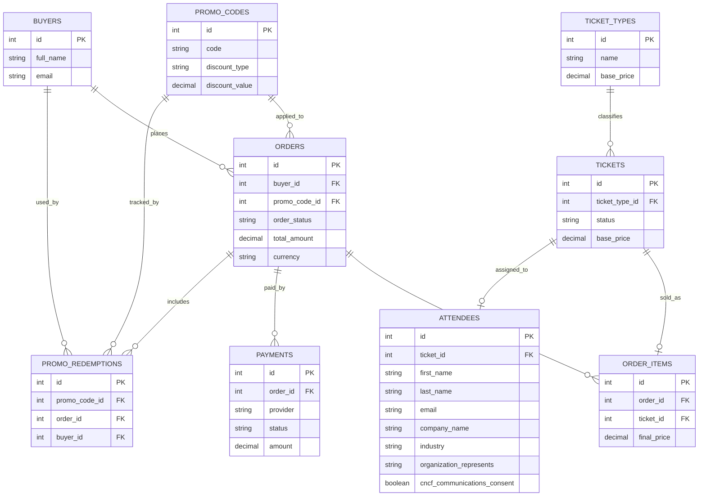

# Data Model

This document describes the relational data model for the ticketing platform. It is designed to be extensible as new features are added. Each table section includes purpose, keys, and relationships. Add new tables by following the same structure.

## Related Docs
- [USE_CASES_DATA_MAP.md](USE_CASES_DATA_MAP.md)
- [db/schema.sql](db/schema.sql)

## Table of Contents
- [Conventions](#conventions)
- [Core Tables](#core-tables)
- [Optional Tables (Add As Needed)](#optional-tables-add-as-needed)
- [Extensibility Guidelines](#extensibility-guidelines)
- [Entity-Relationship Diagram](#entity-relationship-diagram)

## Conventions
- Primary keys are `id` unless stated otherwise.
- Foreign keys are named `{table}_id`.
- Timestamps use `created_at` and `updated_at`.
- Soft deletes (if used) should be `deleted_at`.

## Core Tables

### `buyers`
**Purpose:** Stores buyer information for ticket purchases.

**Columns:**
- `id` (PK)
- `full_name`
- `email` (unique)
- `phone` (nullable)
- `created_at`
- `updated_at`

**Relationships:**
- 1:N with `orders` via `orders.buyer_id`.

### `attendees`
**Purpose:** Stores attendee registration details required by the organizer. Attendees can differ from buyers in batch purchases.

**Columns:**
- `id` (PK)
- `ticket_id` (FK -> tickets.id, unique)
- `first_name`
- `last_name`
- `email`
- `job_title`
- `company_name`
- `company_url` (nullable)
- `work_address` (nullable)
- `country`
- `work_phone` (nullable)
- `emergency_contact` (nullable)
- `github_handle` (nullable)
- `industry`
- `organization_type` (nullable)
- `primary_role` (nullable)
- `organization_represents`
- `first_time_kcd` (nullable, boolean)
- `shirt_size` (nullable)
- `dietary_needs` (nullable)
- `disability_accommodation` (nullable, boolean)
- `person_of_color` (nullable)
- `gender_identity` (nullable)
- `age_range` (nullable)
- `cncf_communications_consent` (boolean)
- `sponsor_communications_opt_in` (nullable, boolean)
- `created_at`
- `updated_at`

**Relationships:**
- 1:1 with `tickets` via `ticket_id`.

### `orders`
**Purpose:** Represents a purchase transaction, including batch purchases.

**Columns:**
- `id` (PK)
- `buyer_id` (FK -> buyers.id)
- `order_status` (e.g., pending, paid, canceled)
- `subtotal_amount`
- `discount_amount`
- `total_amount`
- `currency`
- `created_at`
- `updated_at`

**Relationships:**
- N:1 with `buyers` via `buyer_id`.
- 1:N with `order_items` via `order_items.order_id`.
- 0:1 with `promo_codes` via `orders.promo_code_id` (optional).

### `order_items`
**Purpose:** Line items within an order, one row per ticket.

**Columns:**
- `id` (PK)
- `order_id` (FK -> orders.id)
- `ticket_id` (FK -> tickets.id)
- `unit_price`
- `discount_amount`
- `final_price`
- `created_at`
- `updated_at`

**Relationships:**
- N:1 with `orders` via `order_id`.
- N:1 with `tickets` via `ticket_id`.

### `tickets`
**Purpose:** Inventory of individual tickets and their status.

**Columns:**
- `id` (PK)
- `ticket_type_id` (FK -> ticket_types.id)
- `status` (e.g., available, reserved, sold)
- `base_price`
- `currency`
- `reserved_until` (nullable)
- `created_at`
- `updated_at`

**Relationships:**
- N:1 with `ticket_types` via `ticket_type_id`.
- 1:0..1 with `order_items` via `order_items.ticket_id`.
- 1:0..1 with `attendees` via `attendees.ticket_id`.

### `promo_codes`
**Purpose:** Stores promo codes and pricing rules.

**Columns:**
- `id` (PK)
- `code` (unique)
- `discount_type` (e.g., percentage, fixed)
- `discount_value`
- `starts_at`
- `ends_at`
- `max_redemptions` (nullable)
- `redemptions_count`
- `is_active`
- `created_at`
- `updated_at`

**Relationships:**
- 0:N with `orders` via `orders.promo_code_id` (optional).

## Optional Tables (Add As Needed)

### `ticket_types`
**Purpose:** Defines ticket categories or sales phases (e.g., early bird, general).

**Columns:**
- `id` (PK)
- `name`
- `description` (nullable)
- `sale_starts_at`
- `sale_ends_at`
- `base_price`
- `currency`
- `is_active`
- `created_at`
- `updated_at`

**Relationships:**
- 1:N with `tickets` via `tickets.ticket_type_id`.

### `payments`
**Purpose:** Tracks payment provider interactions and statuses.

**Columns:**
- `id` (PK)
- `order_id` (FK -> orders.id)
- `provider` (e.g., paguelofacil)
- `provider_reference` (nullable)
- `status` (e.g., initiated, authorized, failed, settled)
- `amount`
- `currency`
- `created_at`
- `updated_at`

**Relationships:**
- N:1 with `orders` via `order_id`.

### `promo_redemptions`
**Purpose:** Audit trail for promo code usage.

**Columns:**
- `id` (PK)
- `promo_code_id` (FK -> promo_codes.id)
- `order_id` (FK -> orders.id)
- `buyer_id` (FK -> buyers.id)
- `created_at`

**Relationships:**
- N:1 with `promo_codes` via `promo_code_id`.
- N:1 with `orders` via `order_id`.
- N:1 with `buyers` via `buyer_id`.

## Extensibility Guidelines
- New tables should declare purpose, keys, and relationships.
- Prefer lookup tables for enumerations that may evolve.
- Document any unique constraints and indexes.
- Keep naming consistent with existing conventions.
- Consider lookup tables for attendee dropdowns if values change per event.

## Entity-Relationship Diagram

